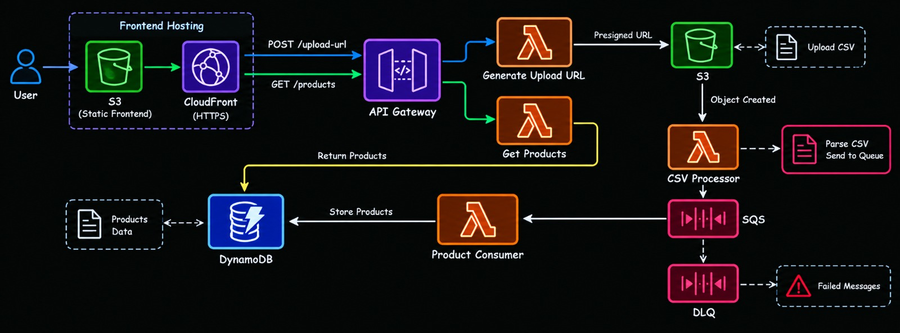
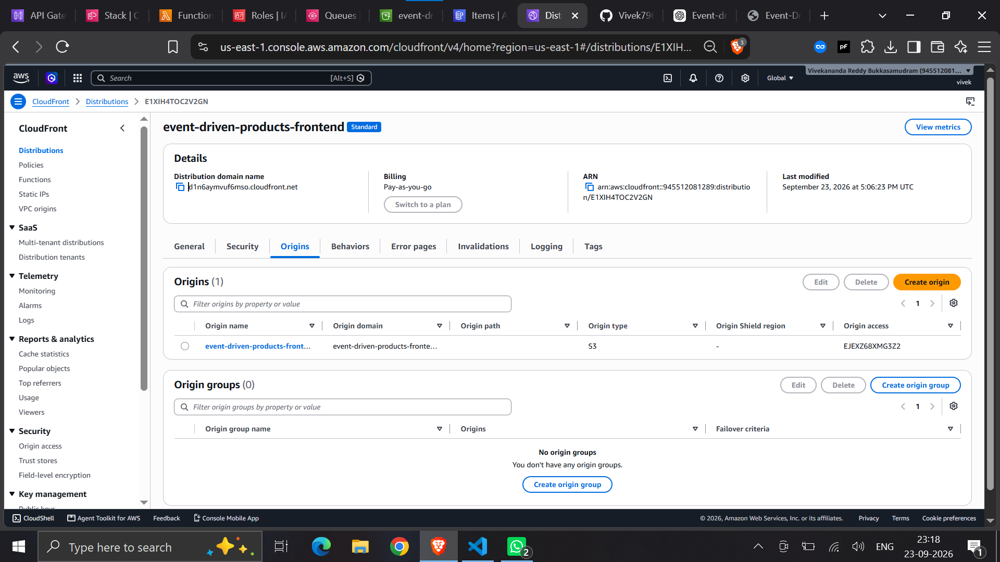
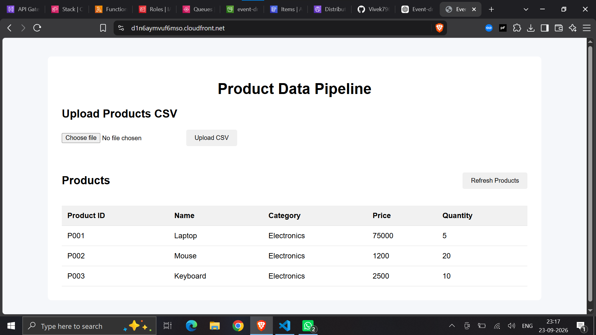
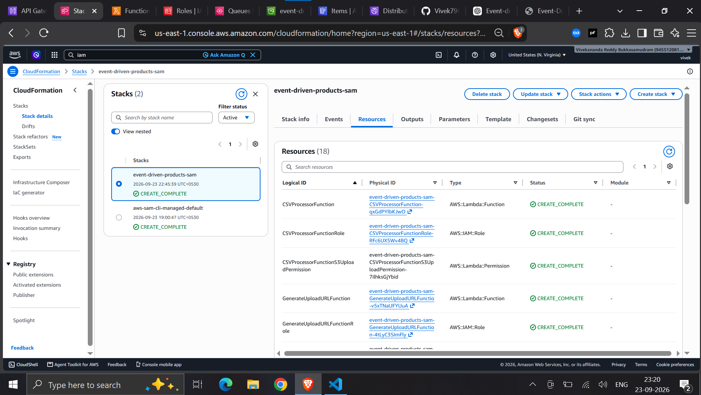
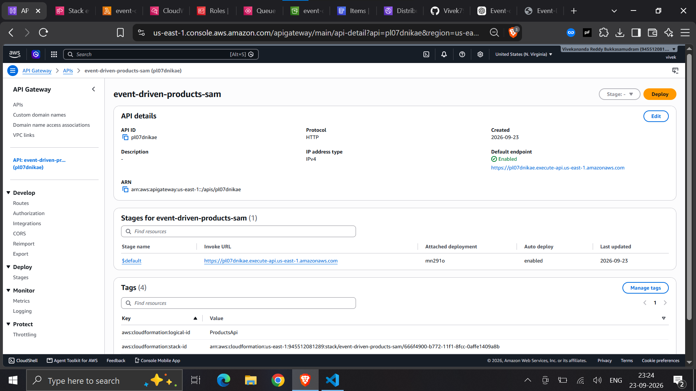
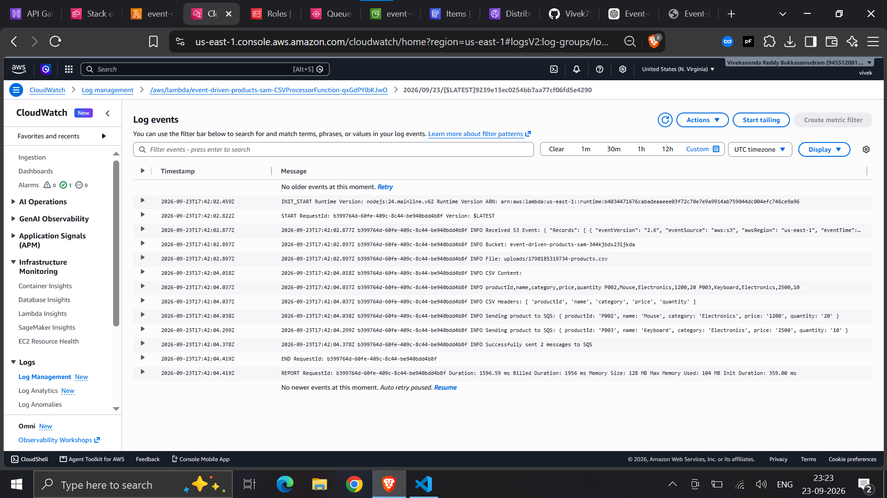
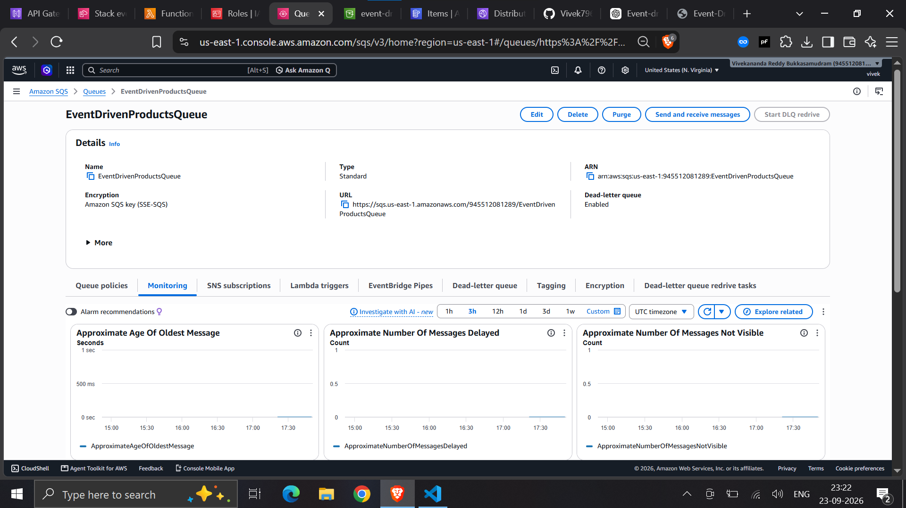
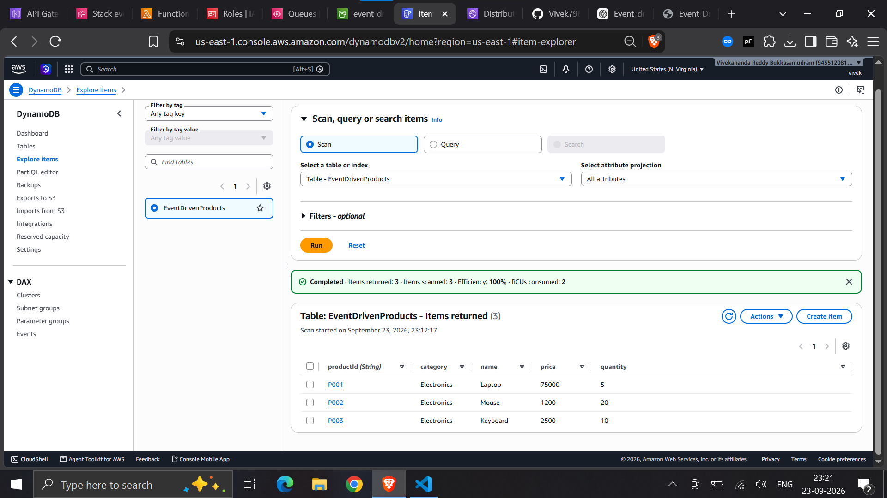
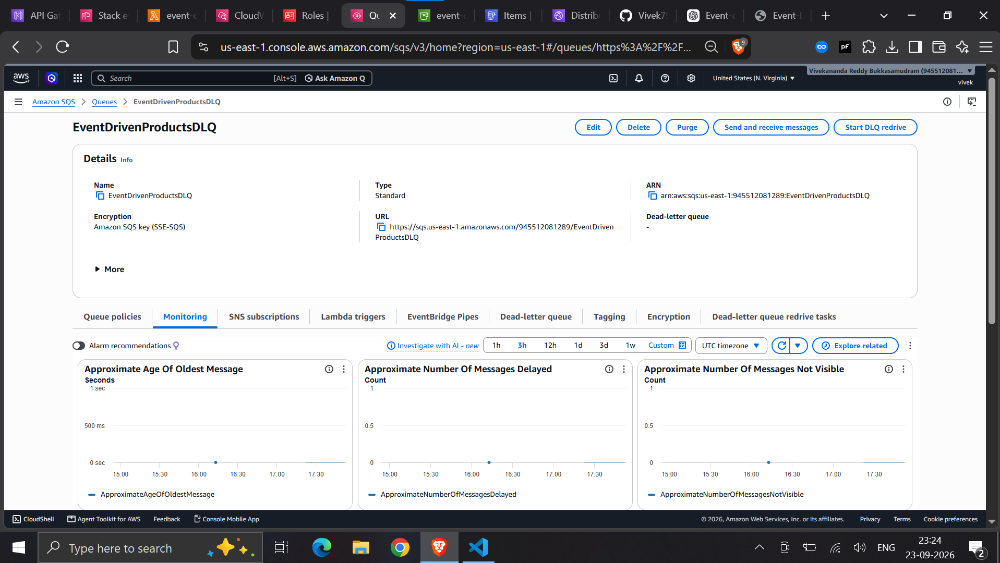
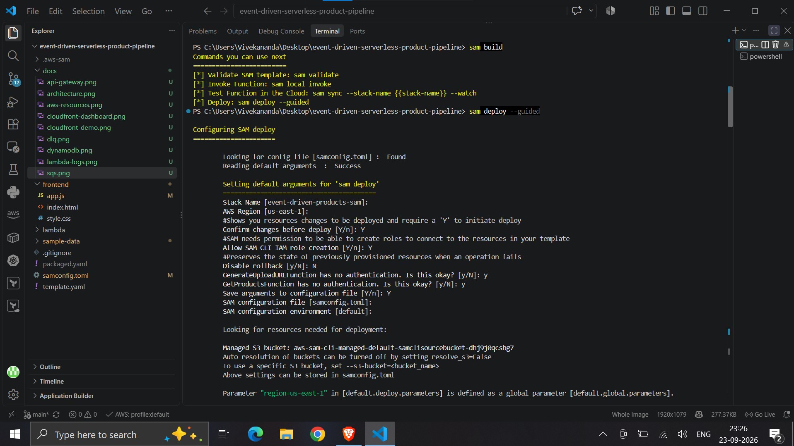

# Event-Driven Serverless Product Processing Pipeline

> A production-style event-driven serverless application built on AWS for uploading, processing, and storing product data from CSV files using Amazon S3, Lambda, SQS, DynamoDB, API Gateway, and CloudFront.


---


## 📌 Overview

This project implements an event-driven serverless product processing pipeline using AWS.

Users access a web application hosted through Amazon S3 and Amazon CloudFront. The frontend allows users to upload CSV files containing product information.

Instead of sending the CSV file through the backend, the application requests a temporary presigned URL from an API Gateway endpoint. The browser then uploads the CSV directly to Amazon S3.

The S3 upload automatically triggers a Lambda function that processes the CSV and publishes individual product records to Amazon SQS.

A second Lambda function consumes the SQS messages and stores the processed products in Amazon DynamoDB.

The frontend can then retrieve the stored products through API Gateway and display them in the web application.

An Amazon SQS Dead Letter Queue is also configured to isolate messages that repeatedly fail processing.

---

## 🏗️ Architecture



### Architecture Flow

```text
                         USER
                           │
                           ▼
                ┌────────────────────┐
                │    CloudFront      │
                │    HTTPS Frontend  │
                └─────────┬──────────┘
                          │
                          ▼
                ┌────────────────────┐
                │   S3 Frontend      │
                │  HTML / CSS / JS   │
                └─────────┬──────────┘
                          │
                     API Requests
                          │
                          ▼
                ┌────────────────────┐
                │    API Gateway     │
                └─────────┬──────────┘
                          │
                ┌─────────┴──────────┐
                │                    │
                ▼                    ▼
       Generate Upload URL     Get Products
             Lambda                Lambda
                │                    │
                ▼                    │
         Presigned URL               │
                │                    │
                ▼                    │
           S3 CSV Bucket             │
                │                    │
         ObjectCreated               │
                │                    │
                ▼                    │
       CSV Processor Lambda          │
                │                    │
                ▼                    │
               SQS                   │
                │                    │
                ▼                    │
       Product Consumer Lambda       │
                │                    │
                └─────────┐          │
                          ▼          ▼
                       DynamoDB ◄────┘
                          │
                          ▼
                         DLQ
```
---

## 🎥 Project Demo

Watch the complete project demonstration:


https://github.com/user-attachments/assets/af1192e6-8044-42bd-ae25-9e182088dfb4


The demonstration covers:

- Uploading a CSV file through the web application
- Generating a presigned S3 upload URL
- Uploading the CSV to Amazon S3
- S3 event triggering the CSV Processor Lambda
- Sending product records to Amazon SQS
- Processing messages using the Product Consumer Lambda
- Storing products in Amazon DynamoDB
- Retrieving products through API Gateway
- Displaying processed products in the frontend
---

# 🔄 End-to-End Workflow

## 1. Frontend Access

The frontend is hosted using Amazon S3 and Amazon CloudFront.

```text
User
 ↓
CloudFront
 ↓
Private S3 Frontend Bucket
```

CloudFront provides HTTPS delivery while Origin Access Control (OAC) allows CloudFront to access the private S3 bucket.

---

## 2. Request Presigned Upload URL

When the user selects a CSV file, the frontend sends:

```text
POST /upload-url
```

to API Gateway.

```text
Frontend
   ↓
API Gateway
   ↓
GenerateUploadURLFunction
```

The Lambda function generates a temporary presigned S3 URL.

---

## 3. Direct CSV Upload

The browser uses the presigned URL to upload the CSV directly to the backend S3 bucket.

```text
Browser
   │
   │ PUT CSV
   ▼
S3
```

This keeps the file transfer separate from the API and Lambda execution path.

---

## 4. S3 Event Triggers Lambda

After the CSV is uploaded, Amazon S3 generates an `ObjectCreated` event.

```text
S3
 │
 │ ObjectCreated
 ▼
CSVProcessorFunction
```

The Lambda function:

- Reads the uploaded CSV
- Extracts the CSV headers
- Converts rows into product objects
- Sends product records to Amazon SQS

---

## 5. SQS Asynchronous Processing

The processed product records are published to:

```text
EventDrivenProductsQueue
```

Example message:

```json
{
  "productId": "P001",
  "name": "Laptop",
  "category": "Electronics",
  "price": "1200",
  "quantity": "10"
}
```

SQS provides asynchronous communication between the CSV processor and the database consumer.

---

## 6. Product Consumer Lambda

The SQS queue triggers:

```text
ProductConsumerFunction
```

The Lambda function:

- Reads the SQS message
- Parses the product object
- Validates the `productId`
- Converts numeric fields
- Writes the product to DynamoDB

```text
SQS
 ↓
ProductConsumerFunction
 ↓
DynamoDB
```

---

## 7. DynamoDB Storage

Processed products are stored in:

```text
EventDrivenProducts
```

The table uses:

```text
productId
```

as the partition key.

---

## 8. Retrieve Products

The frontend sends:

```text
GET /products
```

to API Gateway.

The request flows through:

```text
Frontend
   ↓
API Gateway
   ↓
GetProductsFunction
   ↓
DynamoDB
   ↓
Frontend
```

The retrieved products are displayed in the web application.

---

# ☁️ AWS Services

| AWS Service | Purpose |
|---|---|
| **Amazon S3** | Stores frontend files and uploaded CSV files |
| **Amazon CloudFront** | Serves the frontend over HTTPS |
| **Amazon API Gateway** | Provides HTTP API endpoints |
| **AWS Lambda** | Performs serverless application processing |
| **Amazon SQS** | Provides asynchronous message processing |
| **Amazon SQS DLQ** | Handles repeatedly failed messages |
| **Amazon DynamoDB** | Stores processed product records |
| **AWS IAM** | Provides least-privilege permissions |
| **Amazon CloudWatch** | Provides Lambda execution logs |
| **AWS SAM** | Defines and deploys infrastructure |
| **AWS CloudFormation** | Provisions AWS resources through SAM |

---

# 🧩 Lambda Functions

| Lambda Function | Responsibility |
|---|---|
| **GenerateUploadURLFunction** | Generates temporary presigned S3 upload URLs |
| **CSVProcessorFunction** | Reads uploaded CSV files and sends product records to SQS |
| **ProductConsumerFunction** | Consumes SQS messages and stores products in DynamoDB |
| **GetProductsFunction** | Retrieves products from DynamoDB |

---

# 📡 API Endpoints

| Method | Endpoint | Purpose |
|---|---|---|
| `POST` | `/upload-url` | Generates a temporary S3 upload URL |
| `GET` | `/products` | Retrieves processed products |

---

# 🛡️ Fault Handling

The application uses an Amazon SQS Dead Letter Queue to isolate messages that repeatedly fail processing.

```text
                  ProductsQueue
                       │
                       ▼
             ProductConsumerFunction
                       │
                  Processing
                     Failure
                       │
                     Retry
                       │
                     Retry
                       │
                     Retry
                       │
                       ▼
                ProductsDLQ
```

This prevents repeatedly failing messages from blocking normal processing.

---

# 🏗️ Infrastructure as Code

The backend infrastructure is defined using AWS SAM.

```text
template.yaml
      │
      ▼
   AWS SAM
      │
      ▼
CloudFormation
      │
      ▼
AWS Resources
```

The SAM template provisions the application's:

- Lambda functions
- API Gateway
- S3 bucket
- SQS queue
- SQS Dead Letter Queue
- DynamoDB table
- IAM permissions
- S3 event notifications
- SQS event source mappings

---

# 📁 Project Structure

```text
event-driven-serverless-product-pipeline/
│
├── frontend/
│   ├── index.html
│   ├── app.js
│   └── style.css
│
├── lambda/
│   ├── CSVProcessorFunction/
│   │   ├── index.mjs
│   │   └── package.json
│   │
│   ├── ProductConsumerFunction/
│   │   ├── index.mjs
│   │   └── package.json
│   │
│   ├── GenerateUploadURLFunction/
│   │   ├── index.mjs
│   │   └── package.json
│   │
│   └── GetProductsFunction/
│       ├── index.mjs
│       └── package.json
│
├── sample-data/
│   └── products.csv
│
├── docs/
│   ├── api-gateway.png
│   ├── architecture.png
│   ├── aws-resources.png
│   ├── cloudfront-dashboard.png
│   ├── cloudfront-demo.png
│   ├── demo.mp4
│   ├── dlq.png
│   ├── dynamodb.png
│   ├── lambda-logs.png
│   ├── sam-deployment.png
│   └── sqs.png
│
├── template.yaml
├── samconfig.toml
├── README.md
└── .gitignore
```

---

# 🛠️ Prerequisites

Install:

- AWS CLI
- AWS SAM CLI
- Node.js
- Git
- An AWS account

Verify the installations:

```bash
aws --version
sam --version
node --version
git --version
```

Configure AWS credentials:

```bash
aws configure
```

Verify AWS access:

```bash
aws sts get-caller-identity
```

---

# 🚀 Deployment

## Clone the Repository

```bash
git clone https://github.com/<YOUR_USERNAME>/event-driven-serverless-product-pipeline.git
```

Navigate into the project:

```bash
cd event-driven-serverless-product-pipeline
```

---

## Build

Build the SAM application:

```bash
sam build
```

---

## First Deployment

For the first deployment:

```bash
sam deploy --guided
```

SAM will configure deployment parameters such as:

- Stack name
- AWS Region
- IAM capabilities
- Deployment confirmation
- SAM deployment configuration

The configuration is stored in:

```text
samconfig.toml
```

---

## Subsequent Deployments

After the initial guided deployment:

```bash
sam build
sam deploy
```

No manual packaging or deployment bucket creation is required.

---

# 🧪 Testing

## Test the Product API

The deployed API provides:

```text
GET /products
```

Example:

```bash
curl https://<API_ID>.execute-api.us-east-1.amazonaws.com/products
```

Example response:

```json
{
  "products": [
    {
      "productId": "P001",
      "name": "Laptop",
      "category": "Electronics",
      "price": 1200,
      "quantity": 10
    }
  ]
}
```

---

## Test CSV Upload

1. Open the CloudFront frontend.
2. Select `sample-data/products.csv`.
3. Click **Upload**.
4. The frontend requests a presigned upload URL.
5. The CSV is uploaded directly to S3.
6. S3 triggers `CSVProcessorFunction`.
7. Product records are sent to SQS.
8. `ProductConsumerFunction` processes the messages.
9. Products are stored in DynamoDB.
10. Refresh the frontend to retrieve the products.

---

# 📊 Project Evidence

## CloudFront Hosted Frontend



---

## Working Application



---

## AWS Resources



---

## API Gateway



---

## Lambda Processing



---

## SQS



---

## DynamoDB



---

## Dead Letter Queue



---

## SAM Deployment



---

# 🧹 Cleanup

To remove the SAM-managed application stack:

```bash
sam delete
```

If the application S3 bucket contains objects, the bucket may need
to be emptied before the CloudFormation stack can be deleted.

The manually created CloudFront frontend distribution and frontend
S3 bucket are separate from the SAM application stack and should be
removed separately if they are no longer required.

---

# 👨‍💻 Author

**Vivek**

GitHub:

https://github.com/Vivek7964
